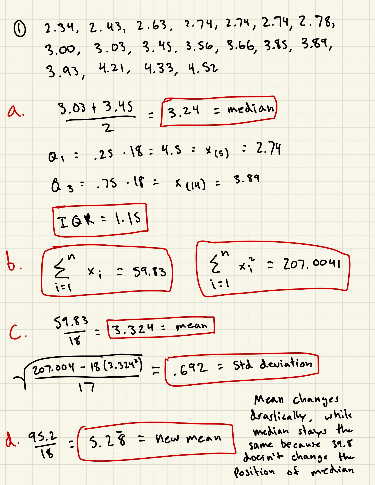
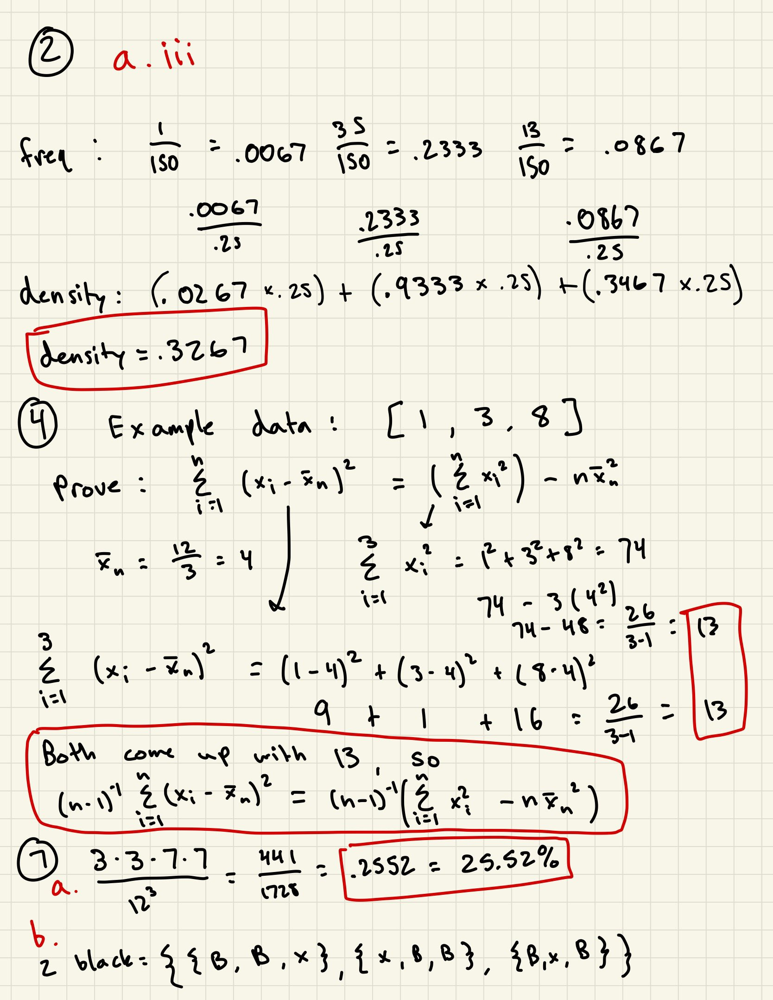
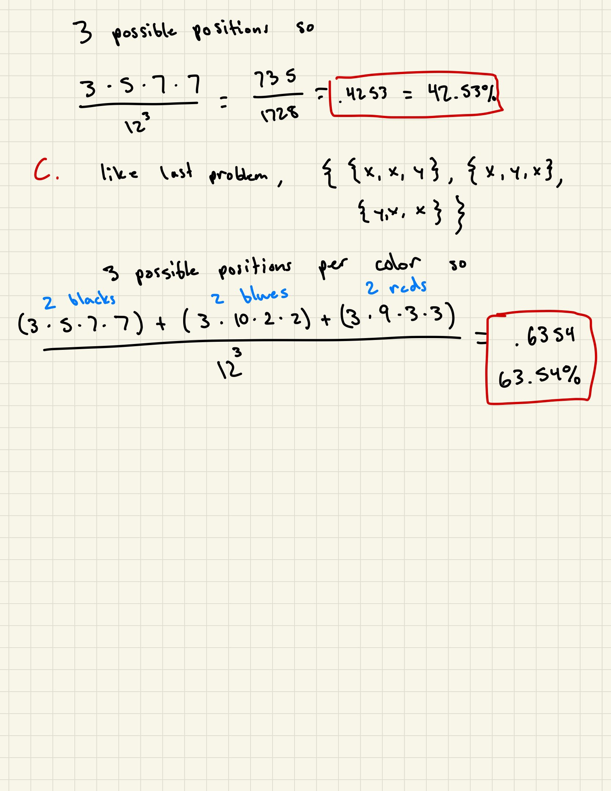

```{r setup, include=FALSE}
knitr::opts_chunk$set(echo = TRUE)
library("dplyr")
```





# Question 2
```{r questionTwoA}
iris <- read.csv("iris.csv", header=TRUE)
histogram <- hist(iris$Petal.Length,
                  breaks=seq(0,8,l=17),
                  main="Petal Lengths of Setosas, Virginicas, and Versicolors",
                  xlab="Petal Lengths (in cm)",
                  ylab="Frequency")
```

The shape of the histogram is bimodal. The percentage of iris flowers with a petal length less than or equal to 2cm is .3267 or 32.67%. 

```{r questionTwoBi}
setosas <- iris %>% filter(iris$Species == "setosa")
setosa_hist <- hist(setosas$Petal.Length,
                  breaks=seq(0,8,l=17),
                  main="Petal Lengths of Setosas",
                  xlab="Petal Lengths (in cm)",
                  ylab="Frequency")

versicolors <- iris %>% filter(iris$Species == "versicolor")
versicolor_hist <- hist(versicolors$Petal.Length,
                  breaks=seq(0,8,l=17),
                  main="Petal Lengths of Versicolors",
                  xlab="Petal Lengths (in cm)",
                  ylab="Frequency")

virginicas <- iris %>% filter(iris$Species == "virginica")
virginica_hist <- hist(virginicas$Petal.Length,
                  breaks=seq(0,8,l=17),
                  main="Petal Lengths of Virginicas",
                  xlab="Petal Lengths (in cm)",
                  ylab="Frequency")
```

The most striking difference between the three is that each are in a different segment of the histogram. For example, the setosa petal lengths are on the lower end, versicolor petal lengths are in the middle, and virginica petal lengths are on the higher end.

Based on the histogram, the setosas have the least variability in petal length because the setosas are not as widely spread out across multiple bins like versicolors and viriginicas are. As shown below, the setosas do indeed have the least variability.

```{r questionTwoBiii}
sd(setosas$Petal.Length)
sd(versicolors$Petal.Length)
sd(virginicas$Petal.Length)
```

# Question 3

```{r questionThree}
apple <- read.csv("APPL.csv", header=TRUE)
ibm <- read.csv("IBM.csv", header=TRUE)
jnj <- read.csv("JNJ.csv", header=TRUE)
sp500 <- read.csv("SP500.csv", header=TRUE)

dates <- apple[,1]
dates <- strptime(dates, "%Y-%m-%d")
dates <- rev(dates)

pApple <- apple[,7]
pApple <- rev(pApple)
pIBM <- ibm[,7]
pIBM <- rev(pIBM)
pJNJ <- jnj[,7]
pJNJ <- rev(pJNJ)
pSP500 <- sp500[,7]
pSP500 <- rev(pSP500)

plot(dates, 8*pApple, ylim = c(500, 2500), col="blue", type="l", xlab = "Year", ylab = "Adj. Closing Price")
lines(dates, 8*pIBM, col="red")
lines(dates, 8*pJNJ, col="green")
lines(dates, pSP500, col="black")

title("Prices of 8*Apple, 8*IBM, 8*JNJ, and SP500")
legend(x="topleft", legend=c("8*Apple", "8*IBM", "8*JNJ", "SP500"), lty=c(1, 1), col = c("blue", "red", "green", "black"), lwd = 1)

logApple <- diff(log(pApple))*100
logIBM <- diff(log(pIBM))*100
logJNJ <- diff(log(pJNJ))*100
logSP500 <- diff(log(pSP500))*100

bp <- boxplot(list(logApple, logIBM, logJNJ, logSP500), names = c("Apple", "IBM", "JNJ", "SP500"), ylim=c(-7,7), col = "pink", xlab="")

summary(logApple)
summary(logIBM)
summary(logJNJ)
summary(logSP500)

IQR(logApple)
sd(logApple)

IQR(logIBM)
sd(logIBM)

IQR(logJNJ)
sd(logJNJ)

IQR(logSP500)
sd(logSP500)
```

Ranked from highest risk to lowest: Apple, IBM, SP500, JNJ.

# Question 5
The first statement is more probable because the second statement is a subset of the first, which means P(second statement) <= P(first statement). Also, from a non-statistics standpoint, LaGrange, Georgia is a lot smaller and more specific than North America. Georgia is not even a tornado hotspot compared to other places in North America, like Kansas, Oklahoma, etc.

# Question 6
### a.
Sample space of flipping a coin three times: {HHH, HHT, HTT, HTH, THH, THT, TTT, TTH}

### b.
i. A = {HTT, TTH, THT}
ii. B = {TTT, TTH, HTT, THT}
iii. C = {HTT, HTH, HHT, HHH}

### c.
P(A) = 3/8, P(B) = 1/2, P(C) = 1/2