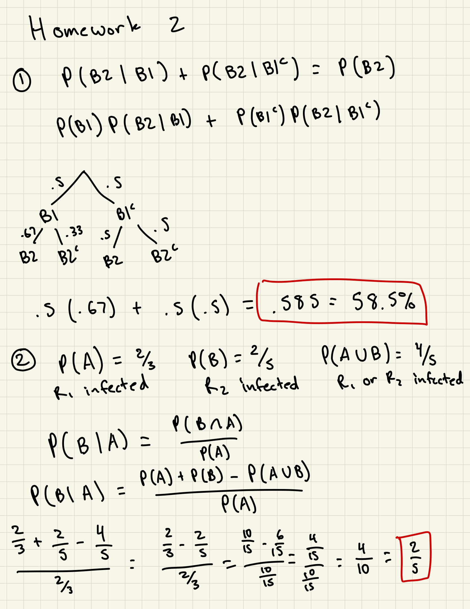
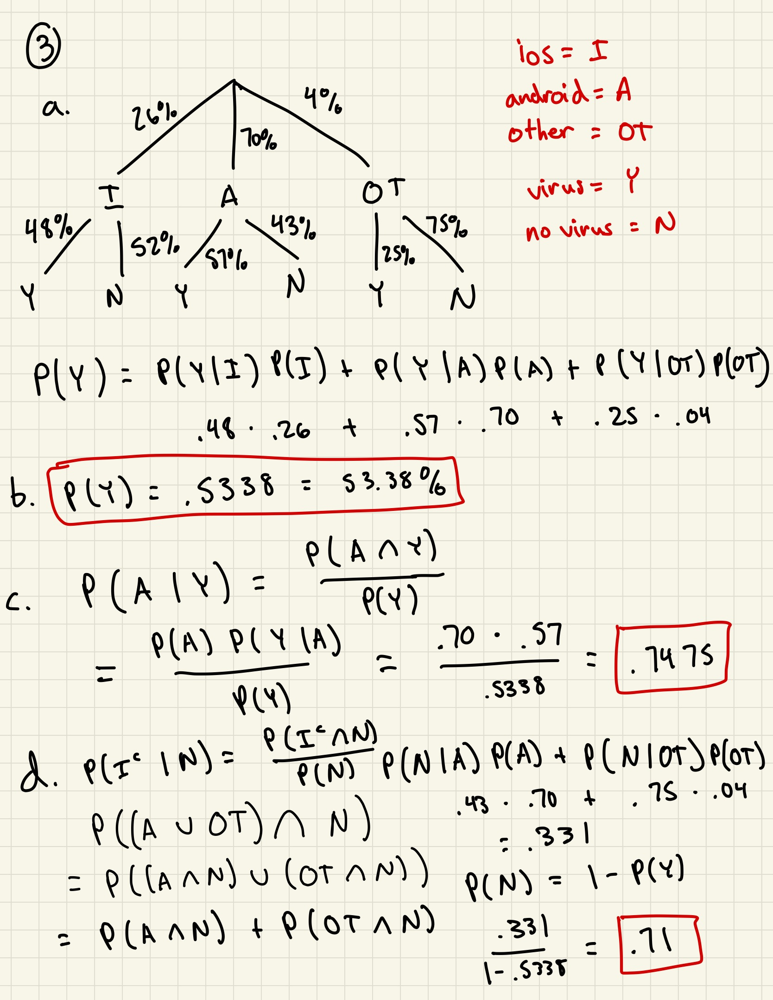
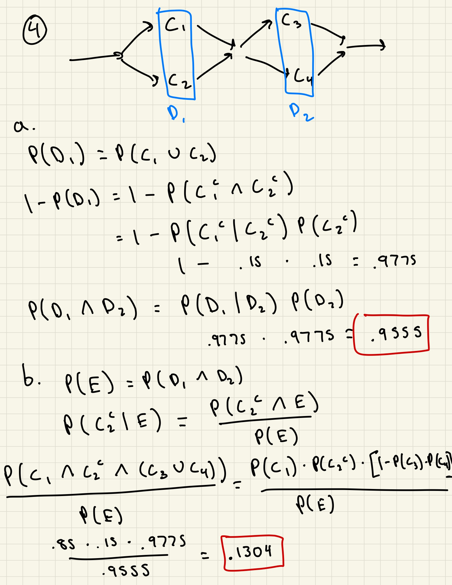
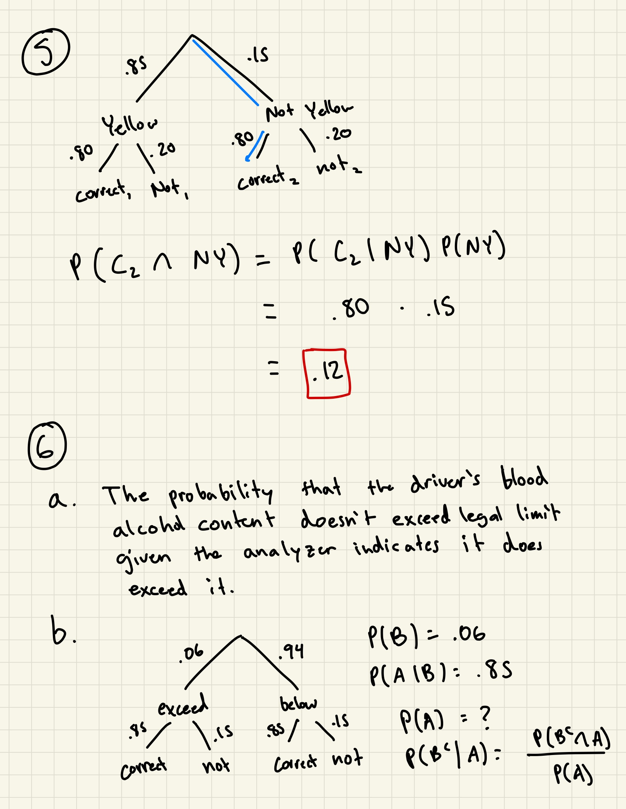
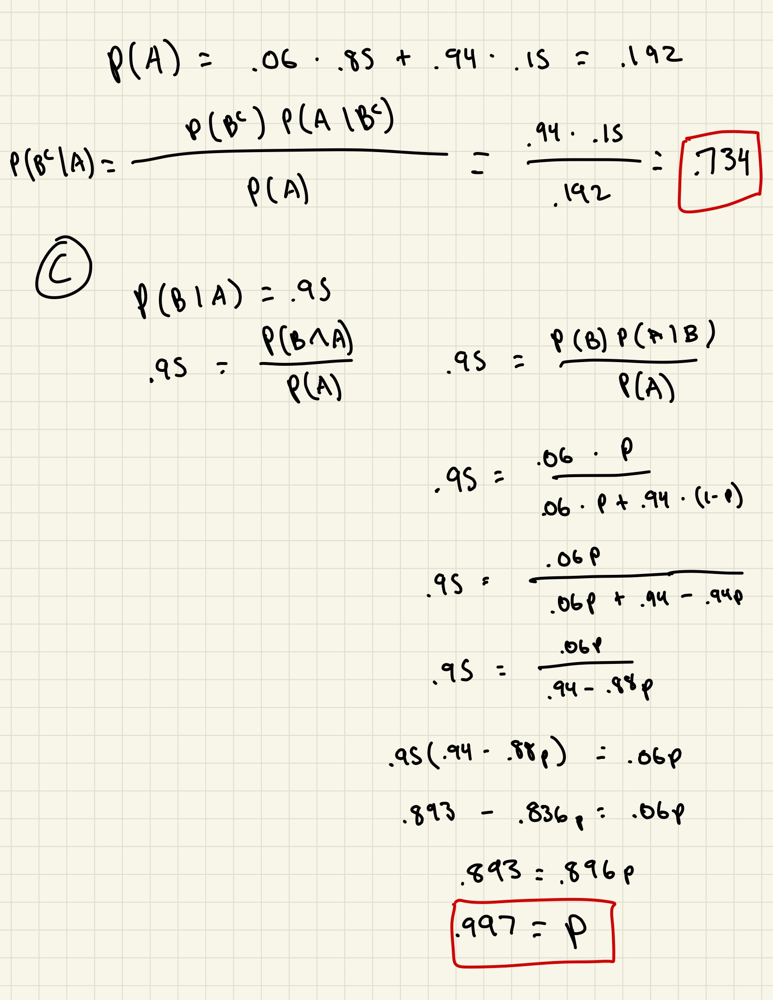

```{r setup, include=FALSE}
knitr::opts_chunk$set(echo = TRUE)
sp500 <- read.csv("SP500.csv")
```







# Question 7
```{r}
pSP500 <- sp500[,7]
pSP500 <- rev(pSP500)
rSP500 <- diff(log(pSP500))*100
ndays <- length(rSP500)
sum(rSP500 < 0)/ndays
```
is the probability that the log-returns are negative.

```{r}
numCons <- sum(rSP500[1:(ndays-1)]<0 & rSP500[2:ndays]<0)
numPrev <- sum(rSP500[1:(ndays-1)]<0)
numCons/numPrev
```
is the probability that it will be down two consecutive days. I would say they are because the probability isn't very high to make us believe that having a down day leads the next day to be down as well.

```{r}
c <- sum(rSP500[1:ndays] >= 1.5)
c/ndays
```
is the probability that the absolute value of the log-returns is at least 1.5%.

Looking for P("following day log-return abs value >= 1.5%" | "abs val log-return of selected day >= 1%").
```{r}
oneP <- sum(rSP500[1:ndays] >= 1)
following <- sum(rSP500[2:ndays] >= 1.5 & rSP500[1:ndays-1] >= 1)
following/oneP
```
is the probability that the following day has an absolute value log-return of at least 1.5% given that the current day is at least 1%.