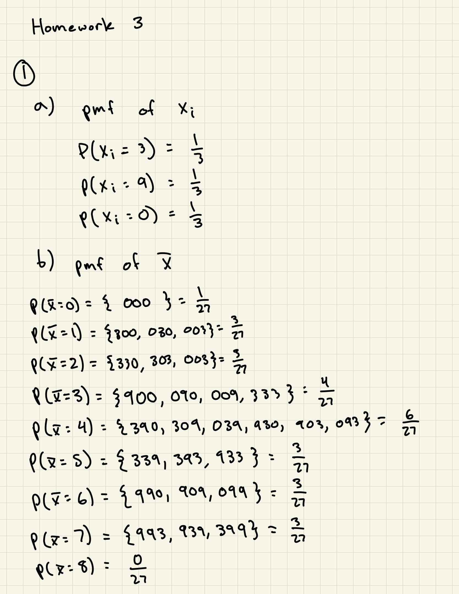
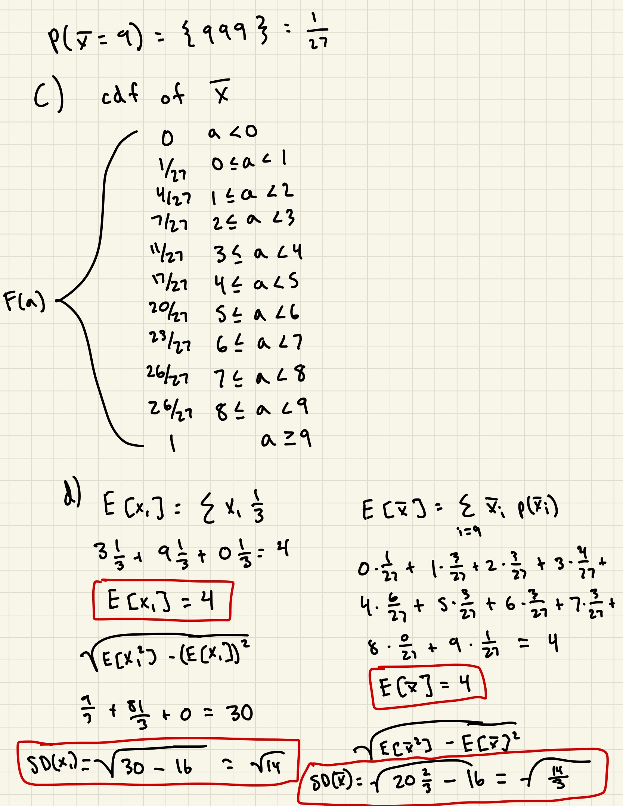
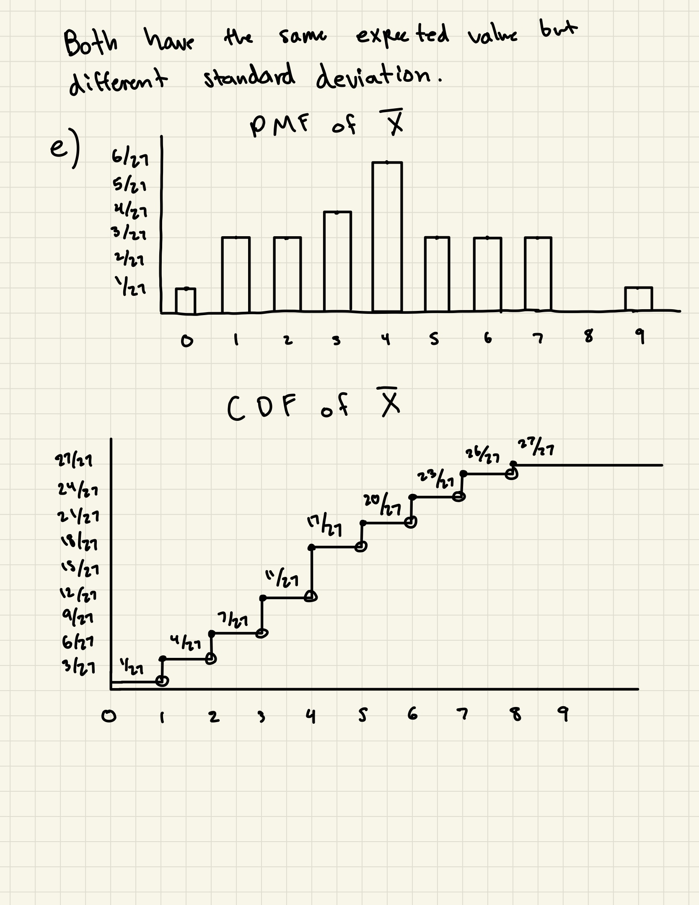
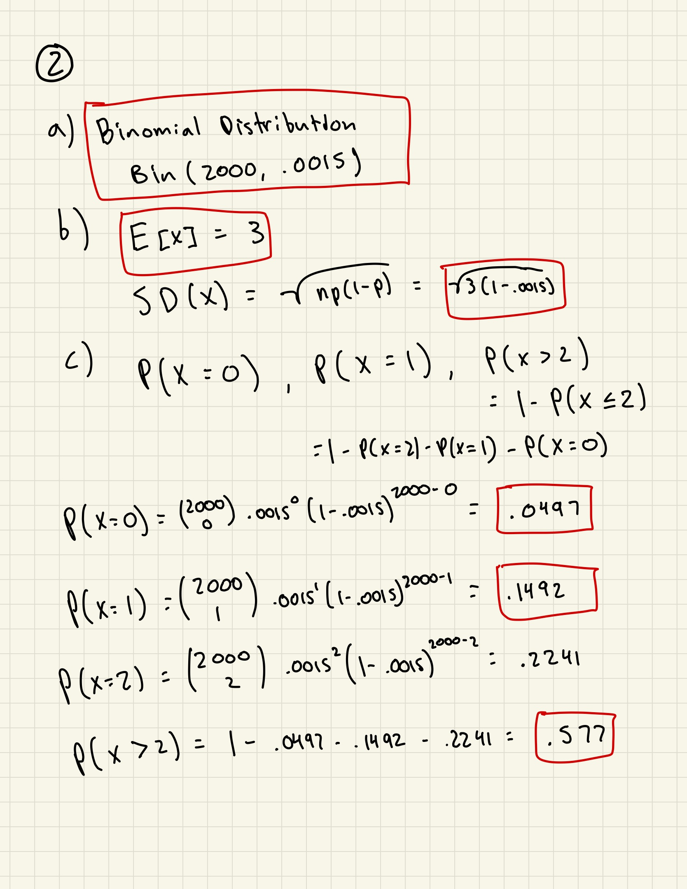
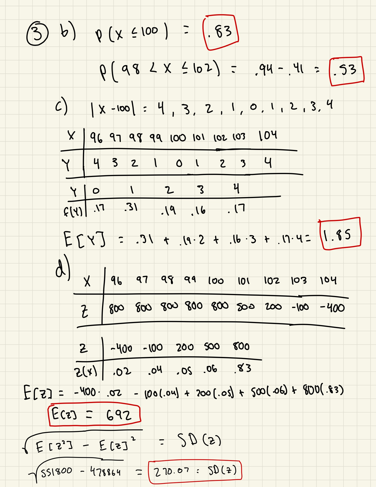

```{r setup, include=FALSE}
knitr::opts_chunk$set(echo = TRUE)
```






# Question 3
```{r}
x <- c(96, 97, 98, 99, 100, 101, 102, 103, 104)
pmf <- c(.15, .12, .14, .25, .17, .06, .05, .04, .02)
cdf <-  stepfun(x, c(0, .15, .27, .41, .66, .83, .89, .94, .98, 1), right=TRUE)
par(mfrow=c(1,2), cex=.8)
plot(x, pmf, type = "h", main = "PMF of the number of ticketed passengers\nwho show up", xlab = "X", ylab = "p(X)")
points(x, pmf, pch = 19)
plot(cdf, main = "CDF of the number of ticketed passengers\nwho show up", xlab = "X", ylab = "F(X)")
points(x, c(.15, .27, .41, .66, .83, .89, .94, .98, 1), pch = 19)
```


# Question 4
```{r}
p <- c(.15, .12, .14, .25, .17, .06, .05, .04, .02)
X <- sample(x, 1000, replace=T, prob=p)
Z <- 800-300*(X-100)*(X > 100)
```

First 10 simulations: [200, 800, 800, 800, 800, 800, 800, 500, 800, 500]

```{r}
counts <- c(length(X[X == 96]) / 1000, length(X[X == 97]) / 1000, length(X[X == 98]) / 1000, length(X[X == 99]) / 1000, length(X[X == 100]) / 1000, length(X[X == 101]) / 1000, length(X[X == 102]) / 1000, length(X[X == 103]) / 1000, length(X[X == 104]) / 1000)
par(mfrow=c(1,2), cex=.8)
plot(x, counts, type = "h", main = "PMF of the number of ticketed passengers\nwho show up", xlab = "X", ylab = "p(X)")
points(x, counts, pch = 19)

prob1 <- length(X[X <= 100]) / 1000
prob2 <- length(X[X > 98 & X <= 102]) / 1000

mean <- mean(Z)
sd <- sd(Z)
```

P(X <= 100) is .84, P(98 < X <= 102) is .537, the mean is 698, and the standard deviation is 263.11. The histograms look the almost exactly the same, the probabilities are almost exactly the same, and the mean and standard deviation are very close as well.