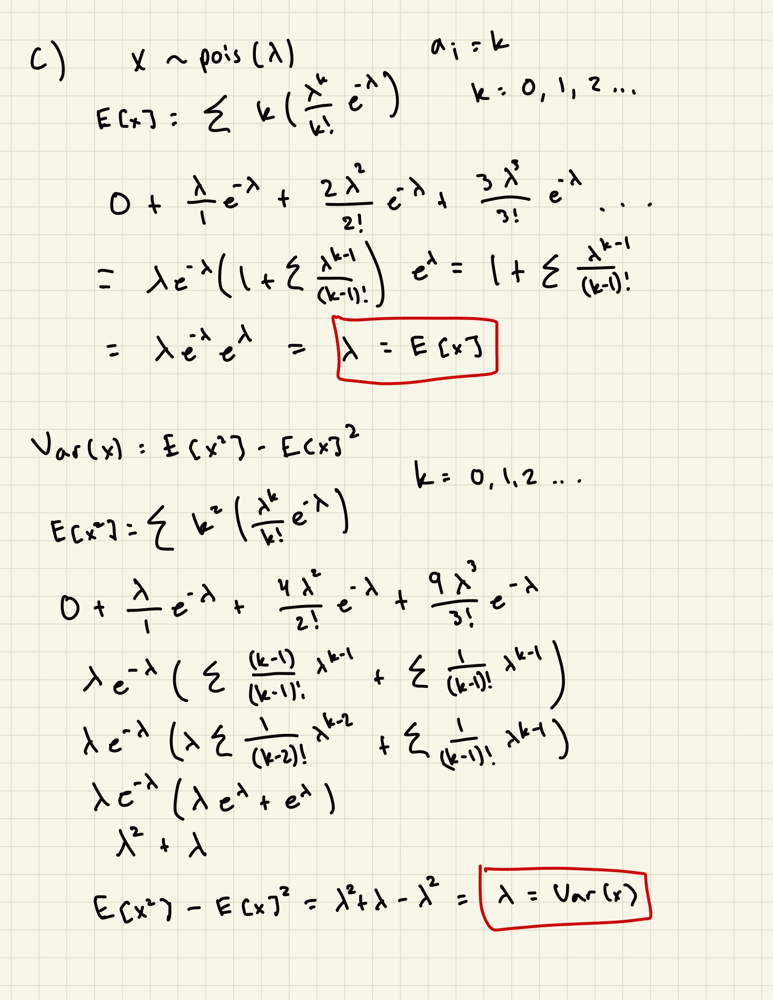

```{r setup, include=FALSE}
knitr::opts_chunk$set(echo = TRUE)
apple <- read.csv("APPL.csv")
jnj <- read.csv("JNJ.csv")
```





# Question 1
a). Geometric Distribution. It has one parameter, *p*, which is the probability of winning at least one of the lotteries. The value we pass in as *p* would be P("win one") = 1 - P("win neither") = (1 - (1 - *p1*)(1 - *p2*))

b). The expected number of times you would need to play for a win would be 1/(1 - (1 - *p1*)(1 - *p2*)).

# Question 5
a).
```{r}
pnorm(65, mean = 50, sd = 10) - pnorm(45, mean = 50, sd = 10)
```

b).
```{r}
top3 <- qnorm(.97, mean = 0, sd = 1)
top3 * 10 + 50
```

c).
```{r}
mean <- qnorm((.9 - .05) / 2)
sd <- (qnorm(.9) - qnorm(.05)) / (2 * qnorm(0.5))
mean
sd
```

# Question 6
```{r}
pApple <- rev(apple[,7])
rApple <- diff(log(pApple))*100
pjnj <- rev(jnj[,7])
rjnj <- diff(log(pjnj))*100

par(mfrow=c(1,2), mar=c(4,4,4,1)+.1, cex=.8)

qqnorm(rApple, col="blue", main="")
qqline(rApple, lwd=2, col="red")
title("rApple: heavier")

qqnorm(rjnj, col="blue", main="")
qqline(rjnj, lwd=2, col="red")
title("rJnJ: heavier")
```
a). The log returns of Apple and JnJ do not follow a normal distribution because the tails are heavier.

```{r}
par(mfrow=c(1,2), mar=c(4,4,4,1)+.1, cex=.8)
x <- (1:length(rApple)-.5)/length(rApple)
qt4 <- qt(x, 4)
res <- qqplot(qt4, rApple, col="blue", main="")
x <- res$x
y <- res$y
abline(lsfit(x, y), col="red", lwd=2)
title("rApple against t(4)")

x <- (1:length(rjnj)-.5)/length(rjnj)
qt4 <- qt(x, 4)
res <- qqplot(qt4, rjnj, col="blue", main="")
x <- res$x
y <- res$y
abline(lsfit(x, y), col="red", lwd=2)
title("rJnJ against t(4)")
```
b). A t-distribution with 4 degrees of freedom seems to be a better fit because it reduces the heavy-tailedness of the log returns.

```{r}
rjnjb <- rjnj[2063:1812]
rjnja <- rjnj[1306:1]

boxplot(rjnjb, rjnja, 
        names = c("Before Crisis", "After Crisis"),
        ylab = "Log Returns")
title("Log Returns Before and After Financial Crisis")

par(mfrow = c(1, 2))  # Create a 1x2 grid for plots

hist(rjnjb, breaks = 15, main = "Before Crisis",
     xlab = "Log Returns", freq=FALSE)

hist(rjnja, breaks = 15, main = "After Crisis",
     xlab = "Log Returns", freq=FALSE)

par(mfrow=c(1,2), mar=c(4,4,4,1)+.1, cex=.8)
res <- qqplot(qlogis(ppoints(length(rjnjb))), rjnjb, col="blue", main="", xlab="Theoretical Quantiles")
abline(0, 1, col="red", main="")
title("rJnJ Before Financial Crisis")

res <- qqplot(qlogis(ppoints(length(rjnja))), rjnja, col="blue", main="", xlab="Theoretical Quantiles")
abline(0, 1, col="red", main="")
title("rJnJ After Financial Crisis")
```
c). Although there are more outliers after the financial crisis, it seems that the log returns after the financial crisis follows a normal distribution a lot better, as the tails aren't as light as before the financial crisis.

```{r}
rApplea <- rApple[1306:1]

par(mfrow=c(1,2), mar=c(4,4,4,1)+.1, cex=.8)
x <- (1:length(rApplea)-.5)/length(rApplea)
qt4 <- qt(x, 12)
res <- qqplot(qt4, rApplea, col="blue", main="")
x <- res$x
y <- res$y
abline(lsfit(x, y), col="red", lwd=2)
title("rApple Against t(12)")

x <- (1:length(rApplea)-.5)/length(rApplea)
hist(rApplea, main="rApple After Financial Crisis", xlab="log return", ylab="Density", freq=FALSE)
curve(dt(x, df=12), add=TRUE, col='red' )
```
d). I believe 12 degrees of freedom is the best fit because it follows the QQ-Plot and histogram well.