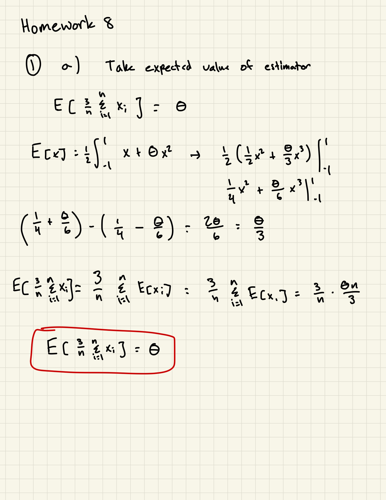
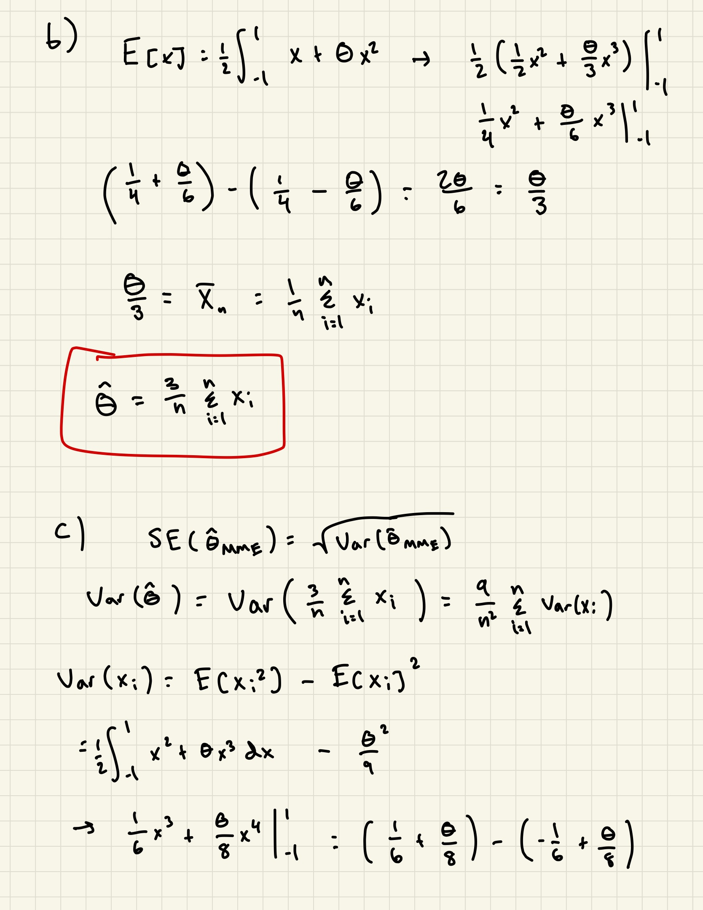
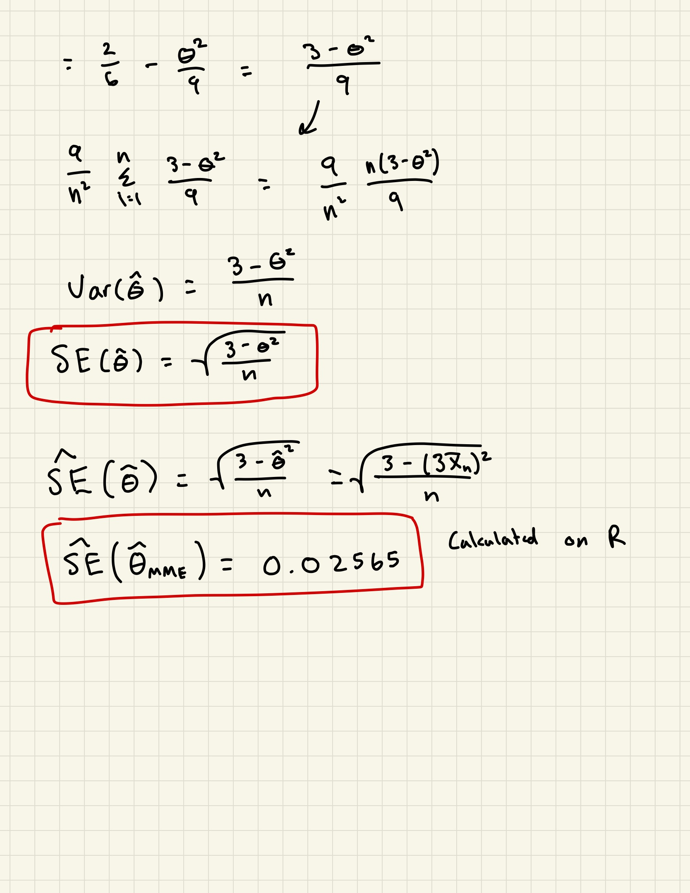
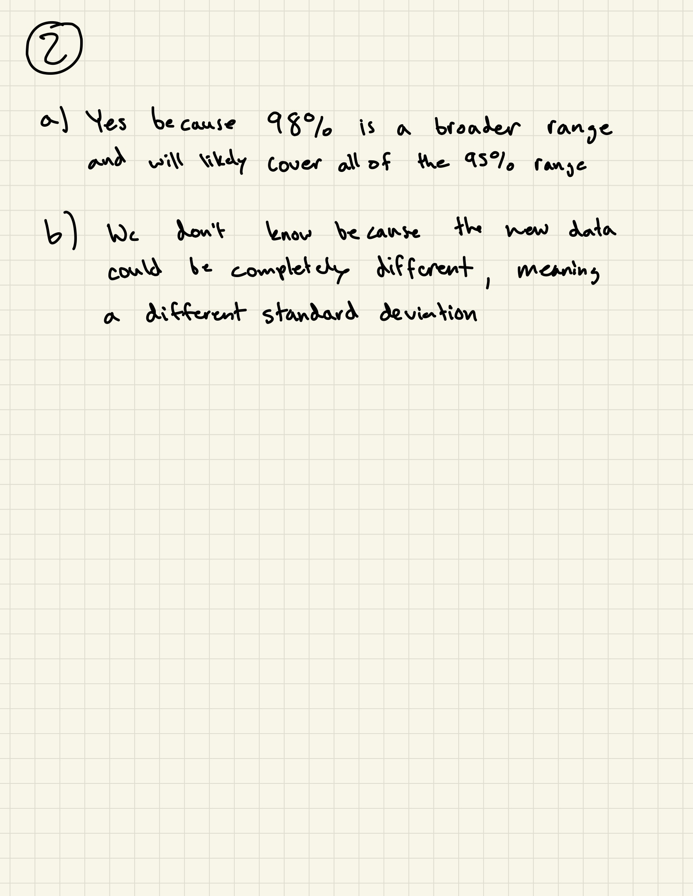
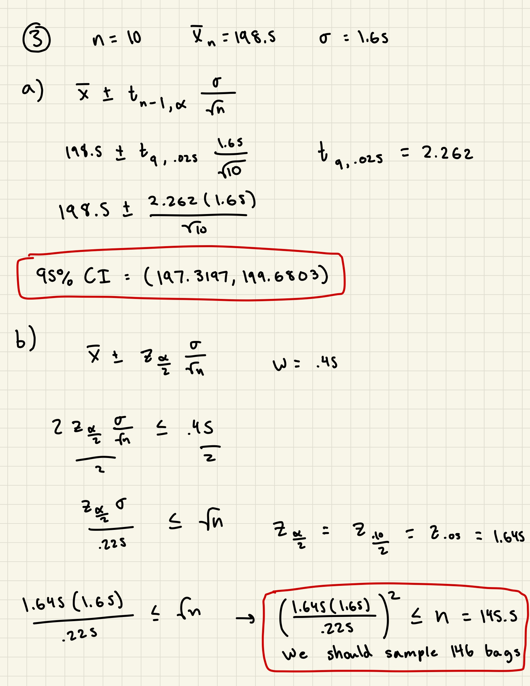
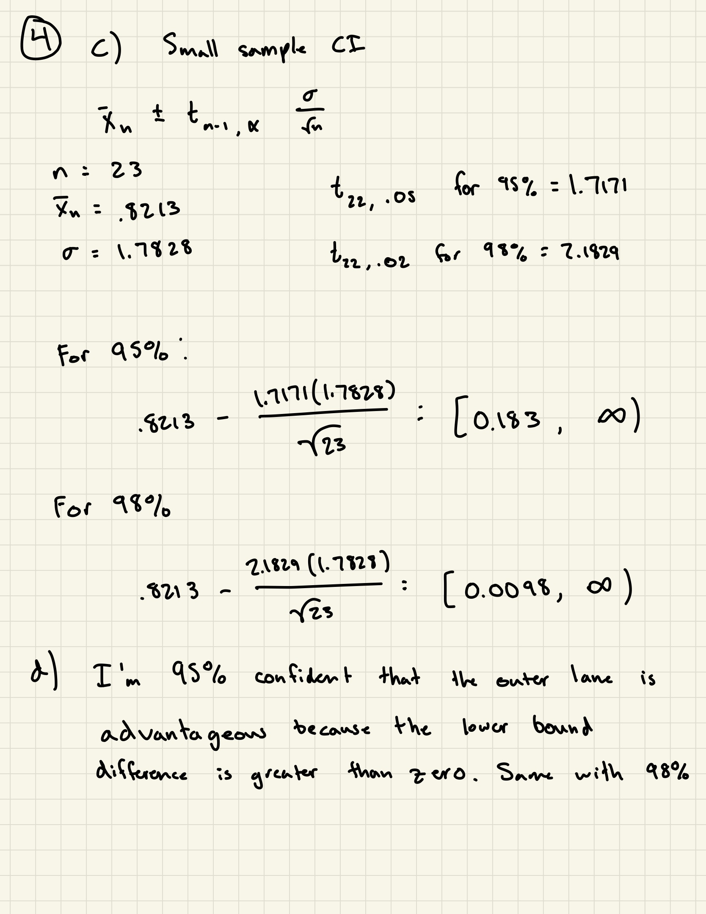

```{r setup, include=FALSE}
knitr::opts_chunk$set(echo = TRUE)

sample_data <- read.delim("sample.txt", header = F)[,1]
olympic_data <- read.delim("olympic1500m.txt", sep = "")
```

# Question 1
```{r}
mean <- mean(sample_data)
se <- sqrt((3 - (3*(mean))^2) / length(sample_data))
se
```










# Question 4
```{r}
hist(olympic_data$Diff, main = "Time Difference Distribution", xlab = "Difference (in seconds)")

time <- olympic_data[,4]
mean(time)
sd(time)
qt(.95, 22)
qt(.98, 22)
```

a) A one-sided CI would be better because we are trying to find if the outer lane has an advantage, not the difference between the times.

b) It is not approximately normally distributed because the histogram is not in a symmetric bell-shaped curve.


